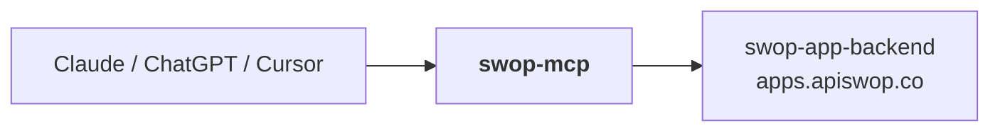

# Swop MCP

Sell to people and AI agents, paid in USDC, from any MCP client.

**Connect:** `https://mcp.swopme.co/mcp/commerce` (Streamable HTTP)
Public tools need no account; account tools use OAuth 2.1 (dynamic client registration, PKCE).
Registry: `io.github.Travisswop/swop`

- Create products and get one link: people see a Buy page, agents get an x402 USDC challenge
- Feature products on your Swop SmartSite
- Checkout on your own site with signed webhooks (`checkout.paid`, `payout.released`)
- Browse and buy from any swop.id's store
- Orders, SmartSite editing, swop.id lookup

Sellers are agent-payable in USDC as soon as they add a product, with no
verification step.

Setup for Claude, ChatGPT, Cursor and Grok: [docs/add-swop-to-your-ai.md](docs/add-swop-to-your-ai.md)

```
claude mcp add --transport http swop https://mcp.swopme.co/mcp/commerce
```

## Tools (`/mcp/commerce`, 26)

Public, no account:
- `swop_search_identities`, `swop_lookup_identity`: swop.id → profile + wallet addresses
- `swop_get_store`: any seller's products with USDC prices and an x402 buy URL for each
- `swop_get_product_link`: the one link that sells a product to people and agents

Sell (scope `commerce.write`):
- `swop_create_product`, `swop_update_product`, `swop_list_my_products`, `swop_feature_product`

Checkout on your own site (scope `commerce.write`):
- `swop_create_checkout`, `swop_get_checkout`
- `swop_register_webhook`, `swop_list_webhooks`, `swop_test_webhook`, `swop_remove_webhook`
  (HMAC-signed `checkout.paid` / `payout.released`)
- `swop_register_embed_origin`, `swop_list_embed_origins`, `swop_remove_embed_origin`

SmartSite storefront (scope `smartsite.write`):
- `swop_get_my_smartsite`, `swop_update_my_smartsite`, `swop_add_link`, `swop_remove_link`
- `swop_create_feed_post`: public post as the linked SmartSite, caption + up to 4 images.
  Two-step: preview returns a sealed `previewId`; confirm resends the identical content,
  and each preview publishes at most once. The backend hosts the images; this server
  uploads nothing.

Account (scopes `profile.read`, `wallet.read`):
- `swop_get_my_profile`, `swop_get_my_orders`, `swop_get_my_balances`,
  `swop_list_my_tokens` (store-credit "Bucks")

The commerce endpoint has no tools that send funds. Its OAuth metadata
(`/.well-known/oauth-protected-resource/mcp/commerce`) advertises only
`profile.read wallet.read smartsite.write commerce.write`.

## Full endpoint (`/mcp`, 41 tools)

`https://mcp.swopme.co/mcp` stays live for existing Swop users. It is the
commerce set plus 15 wallet and market tools (sends, x402 payments, swaps,
perps and prediction-market data); the money-moving ones need the owner to
turn on AI spending, with caps, in the Swop app. New setups should use `/mcp/commerce`.
The same OAuth link works on both endpoints.

## Run

```
npm install
npm run dev          # Streamable HTTP on :8788 (POST /mcp and /mcp/commerce), stateless JSON mode
npm run dev:stdio    # stdio transport for local clients
npm run build && npm start
npm run smoke        # endpoint smoke test (in-process); `npm run smoke -- https://mcp.swopme.co` for prod
```

Env: `SWOP_API_BASE` (default https://apps.apiswop.co), `PREDICTIONS_API_BASE`
(default https://polymarket.apiswop.co), `PUBLIC_BASE_URL` (default
https://mcp.swopme.co), `PORT` (default 8788).

Local test with Claude Code:

```
claude mcp add swop --transport http http://localhost:8788/mcp/commerce
```

## Deploy

Stateless Vercel function (project `swop-mcp`), served at `mcp.swopme.co`
(never swop.tech). Deployed only with `vercel deploy --prod`; a git push does
not ship it. Registry entry: `server.json`, published with `mcp-publisher publish`.

## Where this fits

The AI-assistant edge of the platform. Exposes Swop to anything that speaks MCP,
reaching the same API every first-party client uses.



The identity rule that matters here: **crypto payment is never KYC-gated.** An
agent can pay a seller in USDC with no verification step. Verification gates the
card scope only — never ask a crypto path for identity.

For the cross-repo map, see **[swop-app-backend/docs/ECOSYSTEM.md](https://github.com/Travisswop/swop-app-backend/blob/main/docs/ECOSYSTEM.md)**.
